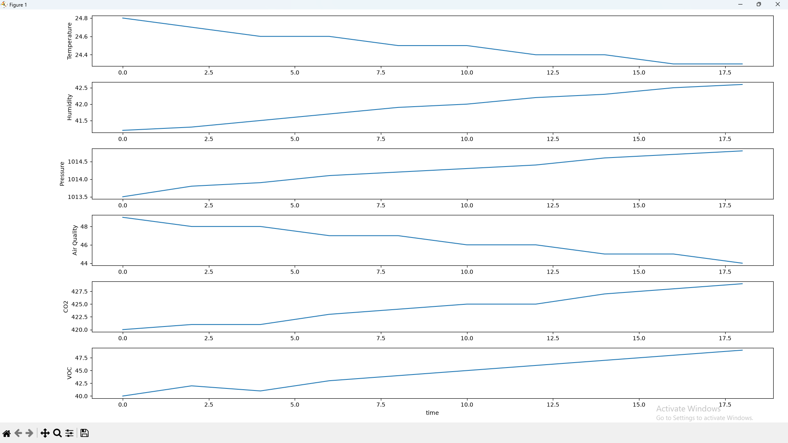

# Climate-Based Monitoring Device — Host Tool Analysis

**Input file:** `C:/Users/[User name]/[Another folder (not required)]/Climate-Based-Monitoring-Device/02_host_tool/tests/output_data/output.bin`  
**Samples processed:** 10  
**Time range:** 18.00 minutes  

---

## Summary Statistics

### Temperature (°C)
- **Min:** 24.30  
- **Max:** 24.80  
- **Average:** 24.51  

**Sparkline:** `█▆▅▅▃▃▂▂▁▁`

---

### Humidity (%)
- **Min:** 41.20  
- **Max:** 42.60  
- **Average:** 41.92  

**Sparkline:** `▁▁▂▃▄▄▆▆▇█`

---

### Pressure (hPa)
- **Min:** 1013.50  
- **Max:** 1014.80  
- **Average:** 1014.23  

**Sparkline:** `▁▂▃▄▄▅▅▆▇█`

---

### Air Quality Index (AQI)
- **Min:** 44.00  
- **Max:** 49.00  
- **Average:** 46.50  

**Sparkline:** `█▆▆▅▅▃▃▂▂▁`

---

### CO₂ (ppm)
- **Min:** 420.00  
- **Max:** 429.00  
- **Average:** 424.30  

**Sparkline:** `▁▁▁▃▄▄▄▆▇█`

---

### VOC (ppb)
- **Min:** 40.00  
- **Max:** 49.00  
- **Average:** 44.50  

**Sparkline:** `▁▂▁▃▄▄▅▆▇█`

---

## Anomaly Detection

**No anomalies detected across all samples.**

---

## Trend Detection

**Change over 18.00 minutes:**

- **Temperature:** Falling (Δ = −0.50 °C)  
- **Humidity:** Increasing (Δ = +1.40 %)  
- **Pressure:** Rising (Δ = +1.30 hPa)  
- **AQI:** Decreasing (Δ = −5.00)  
- **CO₂:** Increasing (Δ = +9.00 ppm)  
- **VOC:** Increasing (Δ = +9.00 ppb)

---

## Overall Assessment

### Environment
Environment shows notable changes in one or more metrics.

#### Weather Interpretation
- Atmospheric pressure is rising → stabilizing or improving weather.  
- Temperature stable.  
- Humidity rising → air may feel more humid.

#### Air Quality & Pollution
- AQI indicates good outdoor air quality.  
- CO₂ levels match clean outdoor baseline.  
- VOC levels typical of rural outdoor air.

#### Comfort Assessment
- Temperature within comfortable indoor range.  
- Humidity within comfortable indoor range.

#### Environmental Stress Indicators
- No signs of environmental stress detected.

*Figure 1 — Trend plot: six stacked time series (Temperature, Humidity, Pressure, AQI, CO₂, VOC) for the sample input (18.00 minutes).*
